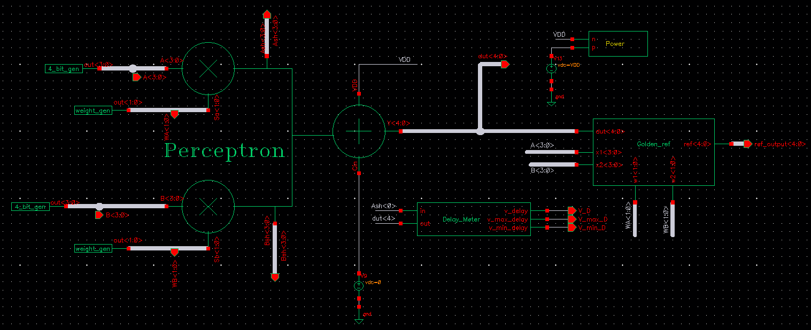

  
  
   
   
  
  
  

  <h2>Adham Mohamed here, and he turns silicon into intelligence!</h2>
  
  
<b>Analog & Mixed-Signal IC Design Enthusiast | Electronics & Communications Student at CUFE</b>

### 🔭 About Me

I'm a Junior Electronics & Communication Engineering student at Cairo University (Expected 2028). 

I specialize in transistor-level circuit design across various CMOS nodes (TSMC 65nm, GlobalFoundries 180nm, and SkyWater 130nm), taking designs from hand analysis all the way through simulation, layout, and verification.

My work relies heavily on the **gm/ID methodology** for precise sizing and biasing, and spans:
- ⚡ **Analog:** OTA topologies (5T, Two-Stage Miller, Telescopic Cascode, Fully Differential Folded Cascode), LDOs, frequency compensation (pole-splitting, RHP-zero cancellation), CMFB network verification, and CMRR/gain/GBW-driven design.
- 💻 **Digital:** Transistor-level datapath design (adders, shifters, ALUs), TSPC logic, FSMs, Logical Effort-based gate sizing.
- 🔬 **Mixed tooling:** Cadence Virtuoso (Spectre/AMS) alongside the open-source Ngspice/Xschem flow, plus ADT Device Xplore for extracting design charts.

I like circuits where the hand analysis and the simulation are made to agree — and where they don't, figuring out exactly why.

### 🛠️ Technical Stack

| Category | Tools & Technologies |
| --- | --- |
| 🟢 **Analog EDA & Simulation** | Cadence Virtuoso (Spectre/AMS), Xschem, Ngspice, ADT Device Xplore, Spice Station AI |
| 🔵 **Digital EDA & Embedded** | Xilinx Vivado, Intel Quartus II, ModelSim, QEMU, Tiva C LaunchPad |
| 📏 **Sizing Methodology** | gm/ID, Logical Effort |
| 🔴 **Languages / HDL**| C, C++, MATLAB, Verilog, VHDL, SystemVerilog, VerilogA |
| ⚙️ **Hardware / Arch** | STM32, Arduino, RISC-V |

### 🧪 Featured Projects

- ⚡ **Two-Stage Miller OTA (0.18µm CMOS):** Designed a differential-input two-stage Miller-compensated OTA using gm/ID. Achieved static gain error ≤ 0.05%, CMRR @ DC ≥ 74dB, phase margin ≥ 70°, and 5V/µs slew rate (≤ 60µA).
- 🔋 **LDO Power Management (65nm CMOS):** Designed an LDO Regulator utilizing gm/ID, evaluating phase margin stability, PSRR, and line/load regulation via rigorous Spectre simulations.
- 🔬 **Telescopic Cascode OTA (0.18µm CMOS):** Designed a single-ended Telescopic Cascode OTA achieving DC gain ≥74dB, CMRR ≥114dB, and GBW ≥20MHz (CL = 5pF). Sized using ADT Device Xplore charts.
- 🧠 **High-Speed Perceptron in 65nm CMOS:** Transistor-level barrel-shifter multiplier + Ripple-Carry adder, Logical Effort sizing, self-checking VerilogA/Spectre AMS testbench, clean DRC/LVS layout (39.5µW average power, 164.3ps max propagation delay).
- ⏱️ **High-Speed TSPC Frequency Divider (65nm CMOS):** Designed a high-speed True Single-Phase Clock (TSPC) D-Flip-Flop frequency divider optimizing power-delay product (fT = 282GHz).
- 👁️ **RISC-V Vectorized Canny Edge Detection (C, QEMU):** Developed and cross-compiled algorithm utilizing RISC-V vector extensions.
- 📡 **FMCW Radar System Simulation (MATLAB):** Executed full signal-processing chain (chirp generation, range-FFT) to extract target range/velocity.

### 💼 Experience

- 🏢 **Analog IC Design Intern** | *Information Technology Institute (ITI)* (Jul 2026 – Sep 2026)
  Designing and simulating OTA topologies using gm/ID methodology, analyzing frequency response, stability, AC/transient noise, CMFB networks, slew rate/PSRR limits, and mismatch constraints.
- 🎓 **Analog IC Design Trainee** | *IEEE Cairo University Student Branch* (Aug 2025 – Oct 2025)
  Designed analog building blocks (0.18µm CMOS), applied gm/gds & Id/W charts using ADT Device Xplore, and implemented Miller compensation for multi-stage amplifier stability targets.

### 📈 How I Work

- **Derive it by hand first, then simulate** — and treat the gap between the two as information, not noise.
- **gm/ID over first-order square-law approximations** wherever bias-point accuracy matters.
- **Document as I go:** most projects end up as a structured LaTeX report.
